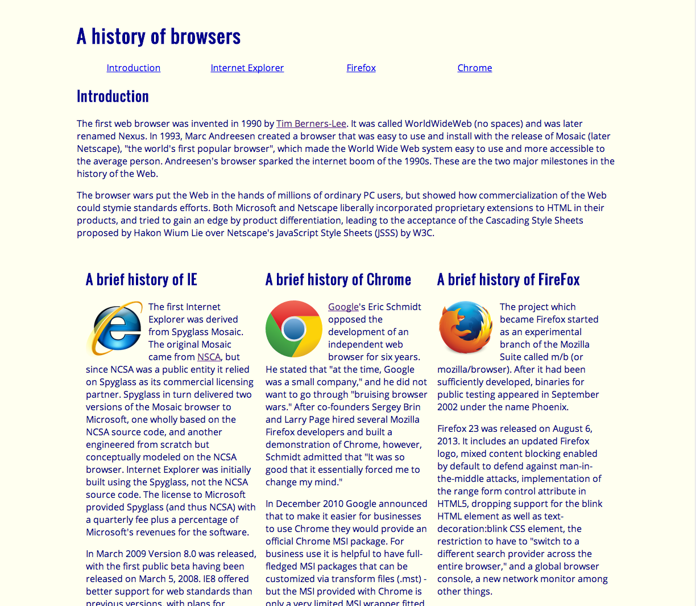
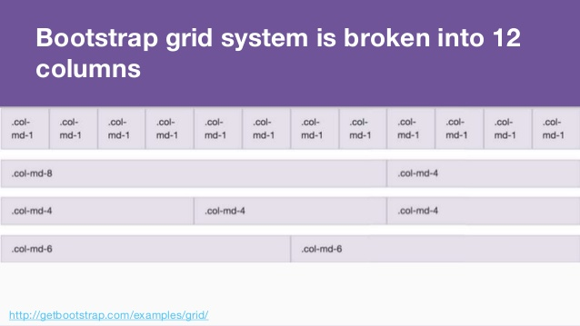

*A user interface (UI) is a medium or platform through which a user interacts with a computer, software application, website, or electronic device. It serves as the point of communication and interaction between the user and the system, allowing users to input commands, provide information, and receive feedback from the system.*

Crafting aesthetically pleasing and functional user interfaces (UIs) is no easy feat, and the decision to use UI frameworks like Bootstrap 5 is a topic worth exploring. Why should we invest our time and effort in learning these tools, rather than sticking to raw HTML and CSS? Do UI frameworks truly offer tangible software engineering benefits? In this essay, we'll dive into the complex world of UI frameworks, such as Bootstrap 5 & Semantic UI.


## The Complexity of UI Frameworks
UI frameworks are collections of pre-written HTML, CSS, and JacaScript code which accelerate the process of web development. They offer a cohesive set of design patterns, responsive layouts, and interactive elements, simplifying the creation of modern, mobile-friendly websites. And learning how to use these frameworks can be just as complicated at first, as it uses its own syntax. 

### Raw HTML and CSS
Creating this website in HTML and CSS focusing on the history of each browser was not extremely complicated, however the website itself has a very simple look in general. 


### The Bootstrap 5 Experience
There are several advantages to using bootstrap 5 over raw HTML and CSS for web developers looking to streamline the development process. With Bootstrap 5 you can quickly buid a functional and and visually appealing prototype using its predesigned componenets. While creating a responsive layout from scratch using only HTML and CSS can be complex, BS5 has a responsive grid system that allows you to create responsive designs effortlessly. For instance, you can use the col-md-6 class to make a div take up half the width of the screen on medium-sized devices using this code snippet:

```cpp
<div class="col-md-6">
                <div class="alert alert-primary" role="alert">
                    This is a half-width column on medium screens.
                </div>
```
This is what it would look like visually:



Furthermore, BS5 prioritizes accessibility. Besides looking good; a website must also be usable by everyone, regardless of disabilities. The framework provides well-structured HTML elements and supports ARIA (Accessible Rich Internet Applications) attributes, making it easier to create web applications that are inclusive and compliant with accessibility standards.


This is the website we made using Bootstrap 5, a webpage for Island Snow. Along with more options for user interface, the website is more complex all around, and was just as easy to build as the browser webpage. 

## All in All 
Although there are a lot of choices when it comes to UI frameworks, BS5 definitely outshines raw HTML and CSS, and I have heard even better things about Semantic UI although I don't personally have any experience with it yet. The struggle of learning Bootstrap 5 is well worth it from a user design perspective. From to improved code quality to increased productivity, software engineers can count this as a valuable asset in their toolbox. Web development continues to be an exciting and evolving landscape, filled with opportunities for creativity and innovation. 
