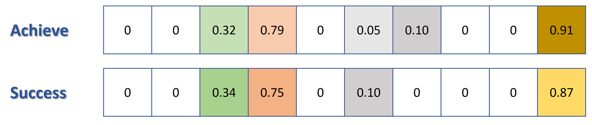
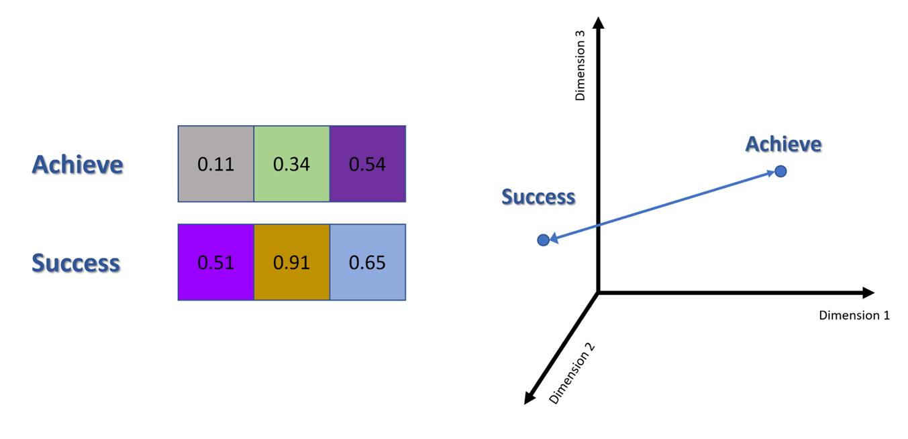

### What are Semantic Embeddings? 
Semantic embeddings are the process of converting words, phrases, or whole documents into numerical form, a.k.a. vectors, so that it can be processed by computers. Vectors can represent in mathematical form meaning, or semantic relevance. They are created using algorithms that analyze large amounts of text and learn to represent each word as a vector in high-dimensional space. Words that appear in similar contexts will be positioned closer together in this space. 

### Vectors
A vector has two parts, a magnitude and a direction. It is a point in space relative to other points in space. How close one word is to another helps models like ChatGPT decide how likely they are to choose that word to come next. 

### High-Dimensional?
From the images below, we can see the importance of using high dimensional analysis versus low. Using just three dimensions just does not capture the all relationships among words and fails to maintain the semantic relationship between two similar words "success" and "achieve".

### Distance Metrics
Some metrics that we can use to define distance are Cosine similarity and Euclidian distance. Cosine similarity measures the angle between two vectors in a multi-dimensional space. Euclidian distance is the straight line distance between two points in space. 

### Tokenization
Tokenization is the process of splitting sentences in to separate words and standardizing them. It involves manipulation and coding practices to encapsulate different rules for different cases. 

For example:

  |                |           |
  |----------------|-----------|
  | is, was, being | be        |
  | unchanged      | unchanged |

# Methods for Embedding

Frequency-based methods (or count-based methods) analyze the frequency and co-occurrence of words within a large amount of text. Some frequency methods are Bag-of-Words (BOW), Term Frequency-Inverse Document Frequency (TF-IDF), and co-occurrence matrix. 

Prediction-based methods focus on generating word embeddings by predicting words from their surrounding context (or vice-versa) rather than relying solely on frequency counts. 

### Word2Vec Algorithms

Word2Vec has two main algorithms; Continuous Bag-of-Words (CBOW) and Skip-Gram. CBOW predicts a target word from a set of context words surrounding it. It has faster and better representations for more frequent words. Skip-Gram is somewhat of the opposite, it predicts surrounding context words from the target word. It works well with small datasets and represents well even rate words or phrases. 

### Doc2Vec Algorithms
Doc2Vec, or Paragraph Vector, is an algorithm that converts a paragraph or document into a vector. The Distributed Bag-of-Words model is based on Skip-Gram with the exception that instead of using the target word as the input, it takes the document ID as the input and tries to predict randomly sampled words from the document. The Distributed Memory Model closely resembles CBOW, the model tries to predict a target word based on the surrounding context words with the addition of a paragraph ID. 

### Bag of Words
BoW treats each document as an unordered collection or "bag" of words. It disregards grammar and word order but keeps track of the frequency of words. However, ignoring word order can have limitations as we derive a lot of context from word ordering. 

### Co-Occurrence Matrix
A co-occurrence matrix shows how often each pair of words appears closer together in text. You would decide on a window, and each time two words appear within the window you record the occurrence by adding a count to the corresponding cell in your matrix. This can be used to find similar words and contexts. 

### Term-Frequency Inverse Document Frequency
Term frequency measures how frequently a term occurs in a document. Inverse document frequency measures the importance of a term across a set of documents. The idea here is that the more documents a term appears in, the less important it is to any individual document. 

