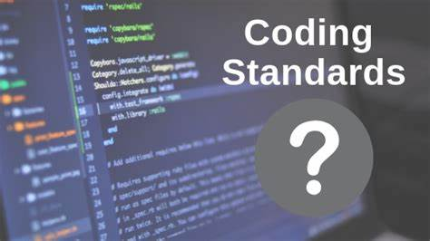

*Standards are established criteria or guidelines that provide consistency, reliability, and consistency across various fields, facilitating uniformity and quality assurance.*

I was pondering on a question earlier this week -- why do we need coding standards? Why are we going through all of this trouble to configure ESLint for it to make my life harder? These questions came after my last couple of Software Engineering assignments. 

When I asked a friend, she said that expecting coding to be easy is only fooling yourself, and she said wouldn't I agree that ESLint is taking some of the trouble away from debugging your own code? I agreed, but I thought to myself there has to be a bigger reason why we are using ESLint... 

## The Finer Details

The more I research coding standards, I learn that they have been a topic of debate in the world of software development. Some view them as trivial; who needs to worry about intentation and curly brace placement. I, however, enjoy the finer details of coding standards and how they are significant beyond their visual aspects. 

### Consistency and Readability
Code consistency is a major component of software development. It facilitates adherance to a set of predefined coding standards. Paying attention to the finer details has a profound impact on clarity and maintainability of code. ESLint is a tool that scans code to bring to your attention deviations from it's established rules. Using ESLint's uniform code formatting, naming conventions, and bracing styles has helped me learn JavaScript that much more, rather than writing code that doesn't work, and not being sure why. 

### Reducing Bugs and Errors 
By providing a predictable structure, it reduces the load placed on the programmer to write code from a new coding language. It also helps catch issues in your code such as
### Community

## Standards in _____?...
## Standards in _____?

## Conclusion?
