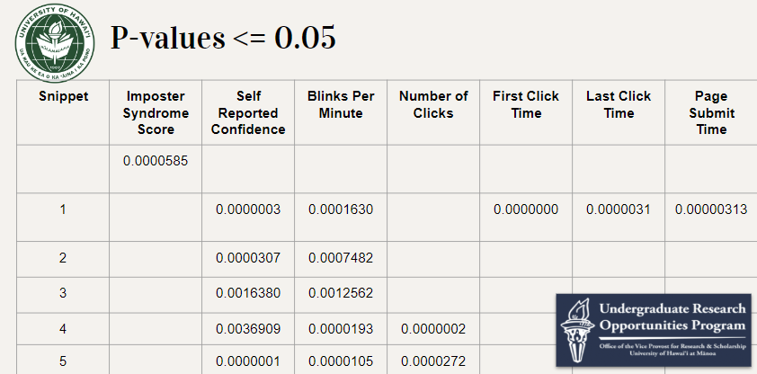
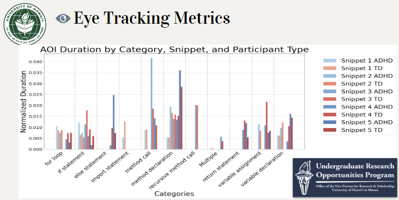
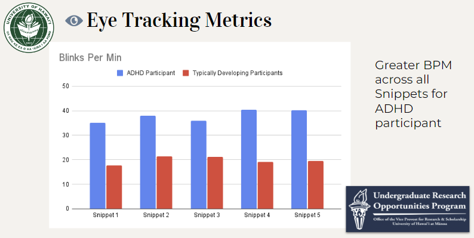
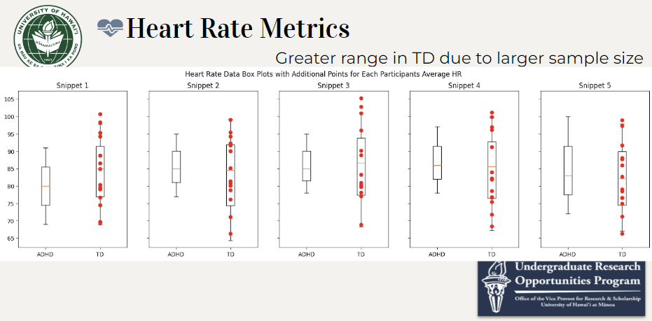
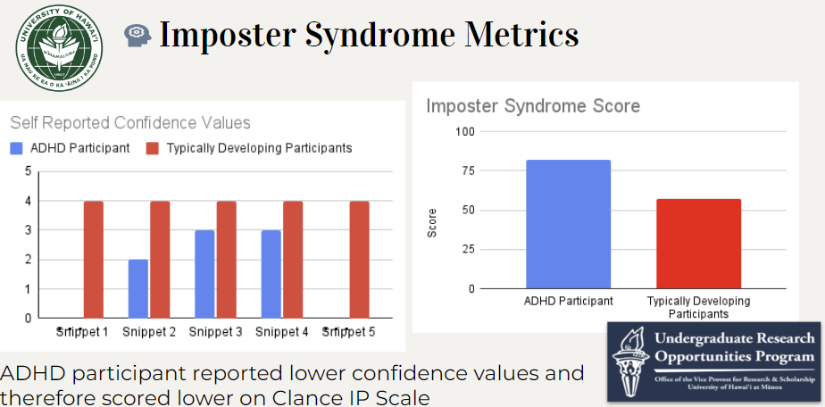
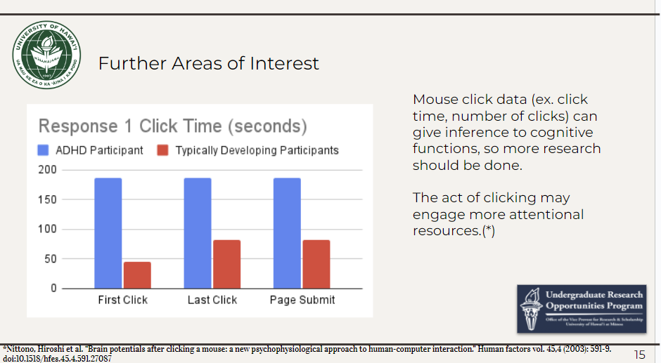

### Exploring differences in physiological and behavioral measures between individuals with ADHD and Typically Developing during code comprehension.

**Abstract:** This study examines the physiological and behavioral differences between Computer Science (CS) students diagnosed with ADHD (Attention Deficit Hyperactivity Disorder) and Typically Developing (TD) during a code comprehension task. For this purpose, physiological and behavioral metrics such as eye movement, Area of Interests (AOI), heart rate, imposter syndrome and confidence questionnaires were measured. An independent sample t-test, specifically Welch’s t-test due to the assumption of unequal variances, was employed to compare the mean scores of the two groups — individuals with ADHD and TD. Preliminary findings suggest significant disparities in multiple physiological and behavioral metrics, including gaze patterns, heart rate variability, and self-reported imposter syndrome scores. These differences highlight the distinct ways in which individuals with ADHD engage with and respond to their environment during code comprehension compared to their TD counterparts. The results of this study could provide insights into tailored educational and professional strategies to accommodate the unique needs of individuals with ADHD in the field of software development and programming.

**Keywords:** ADHD, physiological metrics, behavioral metrics, eye tracking, heart rate, imposter syndrome, t-test, Welch’s test

**Mentors:**
Dr. Katy Territ-Mirakhorli, Dr. Anthony Peruma, Aditi Jaiswal, and Zerin Nasrin Tumpa

**Researcher:** 
Kayla-Marie Torres

# Table of contents
1. [Introduction](#introduction)
    1. [Purpose](#purpose)
2. [Review of Previous Study](#review)
    1. [Key Findings](#keyfindings)
3. [Methods](#methods)
    1. [Statistical Analysis](#analysis)
    2. [Limitations](#limitations)
4. [Results](#results)
    1. [Eye Tracking Metrics](#eyetrackingmetrics)
    2. [Heart Rate Metrics](#heartratemetrics)
    3. [Imposter Phenomenon Metrics](#IPmetrics)
5. [Discussion](#discussion)
6. [Next Steps](#nextsteps)
7. [Acknowledgements](#acknowledgements)

# Introduction 

This analysis is performed under UROP Summer '24 as a part of a pilot study built upon work done by Alyssia Chen and Carol Wong at the University of Hawai'i at Manoa. Their paper and published materials can be found at [this link.](https://zenodo.org/records/10656487) From first receiving the data to creating a presentation on my findings, I gained very beneficial skills in data analysis, research, and statistics. This report provides a comprehensive overview of my journey in hopes to offer readers a glimpse into my contributions to this project and the insights gained this summer. 

## Purpose 
This project involves understanding how computer science (CS) students with Attention-deficit/hyperactivity disorder (ADHD) comprehend (i.e., read and understand) computer programming code. Through this study, we aim to understand areas of code that are typically hard for students to understand as it relates to neurodiverse and typically developing. These findings can help improve the existing CS curriculum and provide insight to how neurodiverse students understand code. We are examining two populations, ADHD and typically developing students, to see if we can measure any distinctions between their code comprehension abilities and challenges. We want to understand the extent to which they are comfortable comprehending code and have confidence in their code analysis. Through this analysis and our pilot study in the fall, Computer Science educators will be better prepared to support neurodiverse students, including mechanisms to support not only the student's technical skills, but also their psychological well-being, creating a more holistic support system.

# Review of Previous Study 
This analysis is performed as a part of a pilot study built upon work done by Alyssia Chen and Carol Wong at the University of Hawai'i at Manoa. Alyssia and Carol’s study focuses on impostor syndrome, a psychological phenomenon characterized by persistent self-doubt and feelings of inadequacy despite evidence of competence. The participants were presented with five Java code snippets, carefully selected to represent typical programming challenges encountered during entry-level software engineering job interviews. These code samples were designed to simulate the types of questions recent college graduates are likely to face when applying for their first positions in the field. Their paper and published materials can be found at this link. The goal of their paper was to examine the prevalence and relationship of imposter syndrome and code comprehension performance in fourth-year Computer Science students through an augmented cognitive approach. 

## Key Findings 
The key findings of their study included; (1) students who identified as males show lower levels of imposter syndrome, (2) those with higher levels of imposter syndrome are associated with increased duration of time spent on a code snippet, (3) students with lower levels of imposter syndrome had a higher chance of solving the problem correctly, and (4) those with higher imposter syndrome levels are more likely to look at method declaration and method call categories in a given code snippet. In their study, one student out of 15 has Attention-deficit/hyperactivity disorder (ADHD). I was given access to their raw and processed data and tasked with exploring any differences between this student and the other typically developing students. 

# Methods 

The metrics used in this study included eye tracking Areas of Interest (AOIs), blinks per minute and gaze patterns, heart rate metrics, and imposter syndrome scores, measured on Clance IP scale. 

## Statistical Analysis 
I chose to use a t-test for this data due to the small sample size. I am comparing the means of two independent groups,(non-ADHD vs. ADHD participant), therefore this test is suitable. In this case I will assume unequal variance because of the difference in sample sizes (1 vs. multiple) which inherently suggests that the variances are unlikely to be equal. The assumption of equal variances (homoscedasticity) is generally more plausible when sample sizes are similar and drawn from the same population. Assuming unequal variances is a more conservative approach, which will reduce the risk of false positives. For this case (different sample sizes) the Welch’s t-test (unequal variance independent t-test) is suitable. Before we can merge the data to perform the t-test, we must encode the data so that the categorical columns are numerical. 

Click here to see encoded data

 

|  | How confident are you in your answer? |
| --- | --- |
| 0 | N/A (I answered 'I don't know' in the last question) |
| 1 | Not confident at all |
| 2 | Slightly confident |
| 3 | Somewhat confident |
| 4 | Fairly confident |
| 5 | Completely confident |

|  | T/F |
| --- | --- |
| 0 | False |
| 1 | True |

|  | AOIs |
| --- | --- |
| 0 | import statement |
| 1 | variable declaration |
| 2 | variable assignment |
| 3 | method declaration |
| 4 | if statement |
| 5 | else statement |
| 6 | for loop |
| 7 | method call |
| 8 | recursive method call |
| 9 | return statement |
| 10 | choice |

|  | Questionnaire |
| --- | --- |
| 0 | not at all true |
| 1 | rarely |
| 2 | sometimes |
| 3 | often |
| 4 | very true |

|  | Q22 |
| --- | --- |
| 0 | No |
| 1 | Yes |

After this, I took the average of the numerical columns and the mode of the categorical columns to get a value for all of the typically developing students’ data (ID==15) to compare against the ADHD participant. Then, I calculated the t-statistic, degrees of freedom, and p-value. 

## Limitations 

Due to the disparity in sample sizes, the following results ***exhibit reduced statistical significance.*** Consequently, these findings should be interpreted with caution. For a more robust analysis in the pilot study, it is recommended to collect additional data to achieve balanced sample sizes.

# Results 
In the following areas we found the p-value to be less than 0.05, displaying a difference in the ADHD student and Typically Developing students’ data; Imposter Syndrome Score, Self-reported Confidence values, Blinks per Minute, Number of Clicks, First Click Time, Last Click Time, and Page Submit Time. 

## Eye Tracking Metrics 

There were some Areas of Interest (AOIs) where the ADHD participant gazed longer than the TD participants, and in some cases the difference was much longer. However, we could not generalize anything, but we wanted to see if there was a difference in pattern to look into. 

The ADHD participant displayed greater blinks per minute throughout each code snippet. However, this was expected because it is researched that people with ADHD blink more than typically developing. 

## Heart Rate Metrics 

TD participants have a greater range for min and max heart rate which is expected due to the difference in sample sizes. Not much of a difference in heart rate between groups.

## Imposter Phenomenon Metrics 

The ADHD participant scored higher on Clance's Imposter phenomenon scale which was designed to help individuals determine whether they have IS and if so, to what extent they are suffering
because the TD participants had higher self reported confidence values, they have a lower IS score

## Discussion 
After performing this analysis, it is my recommendation that click timing should be studied further. This was one of the most noteworthy findings from my analysis which I spent a lot of time on and strongly believe that it should be studied to the fullest extent in the pilot study. Mouse click data can give insight to cognitive functions, especially in Computer Science and neurodiverse populations. This data was only recorded for one snippet due to it not being needed in the previous study. The ADHD participant waited longer to make each type of click; first click, last click and submit page time. Metrics such as eye tracking, heart rate, and Imposter Syndrome scores were used as a foundation for research on potential differences between ADHD and TD during code comprehension. Further research is needed to establish a connection. This analysis serves as the preliminary investigation for a pilot study in the fall.

## Next Steps 
This fall I will work under Dr. Katy and Dr. Peruma and alongside Alyssia Chen to further this research. We hope to increase our sample sizes in order to gain more meaningful and statistically significant insights. 

## Acknowledgements 
Thank you to UROP for funding this research. A special thank you to Dr Katy for this opportunity. Thank you to Dr Peruma, Aditi Jaiswal, and Zerin Nasrin Tumpa for mentoring me along the way.

---
  