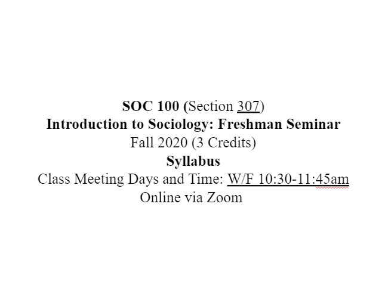

  As an introductory Sociology class we explored theorists such as Karl Marx, Emile Durkheim, and Max Weber. And topics such as functionalism and modernism, critical theory, race, class, globalization, group conflict, symbolic interactionism, and feminist theories, just to name a few. I expected my students to actively engage with class materials, write discussion post responses before the next class, and incorporate lecture and discussion content into their posts. I encouraged them to think creatively and emphasized my genuine interest in their discussion posts. Additionally, I assigned two 1500-word Vignette Papers, which allowed students to explore sociological concepts using real or fictional experiences they found interesting. These assignments aimed to spark their curiosity about sociology. Throughout the class I emphasized the importance of actively pursuing knowledge and taking control of one's life through learning. I encouraged them to continue learning beyond the classroom through books, podcasts and movies. 

  This experience helped me decide if I wanted to pursue a Masters of Sociology, which I was on track for at this time. I came to realize that I wanted something different out of life and that learning the ins and outs of our society is not for the faint of heart, due to the miles of injustice intertwined in it's foundation. I changed career paths to Computer Science in order to build a life I wanted to live. It is my hope that I can use my sociology degree alongside my future computer science degree to put both passions to work.

